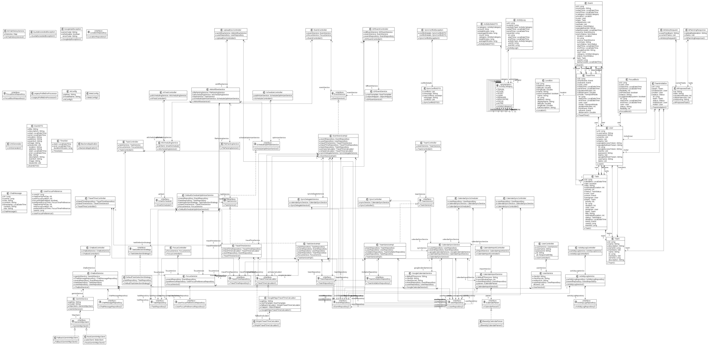
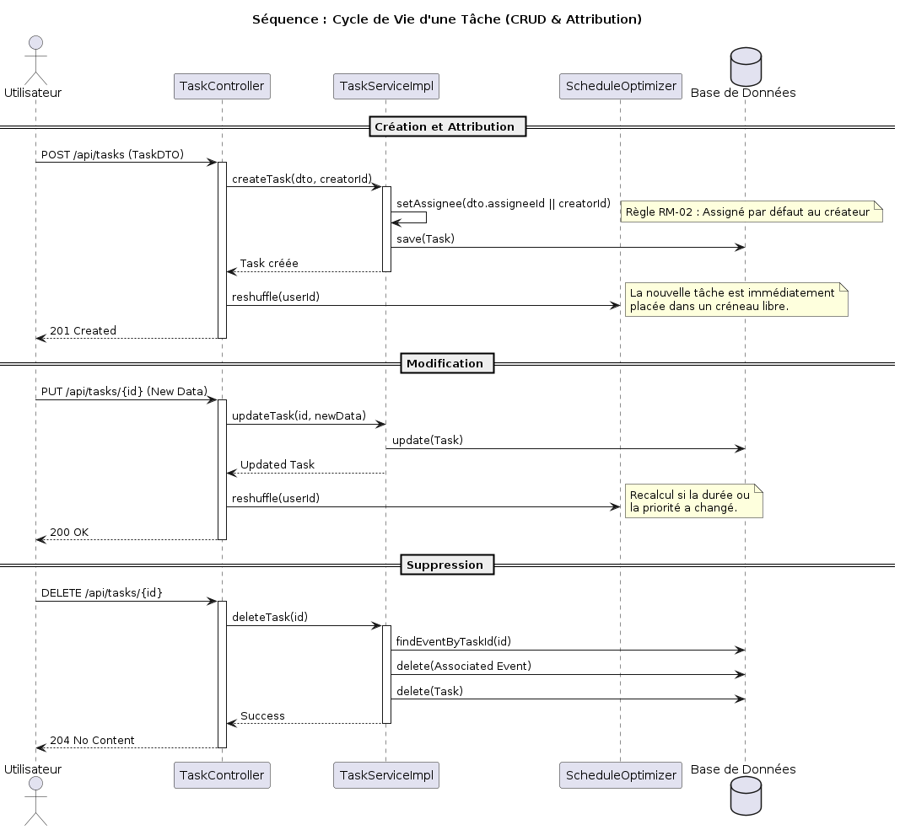
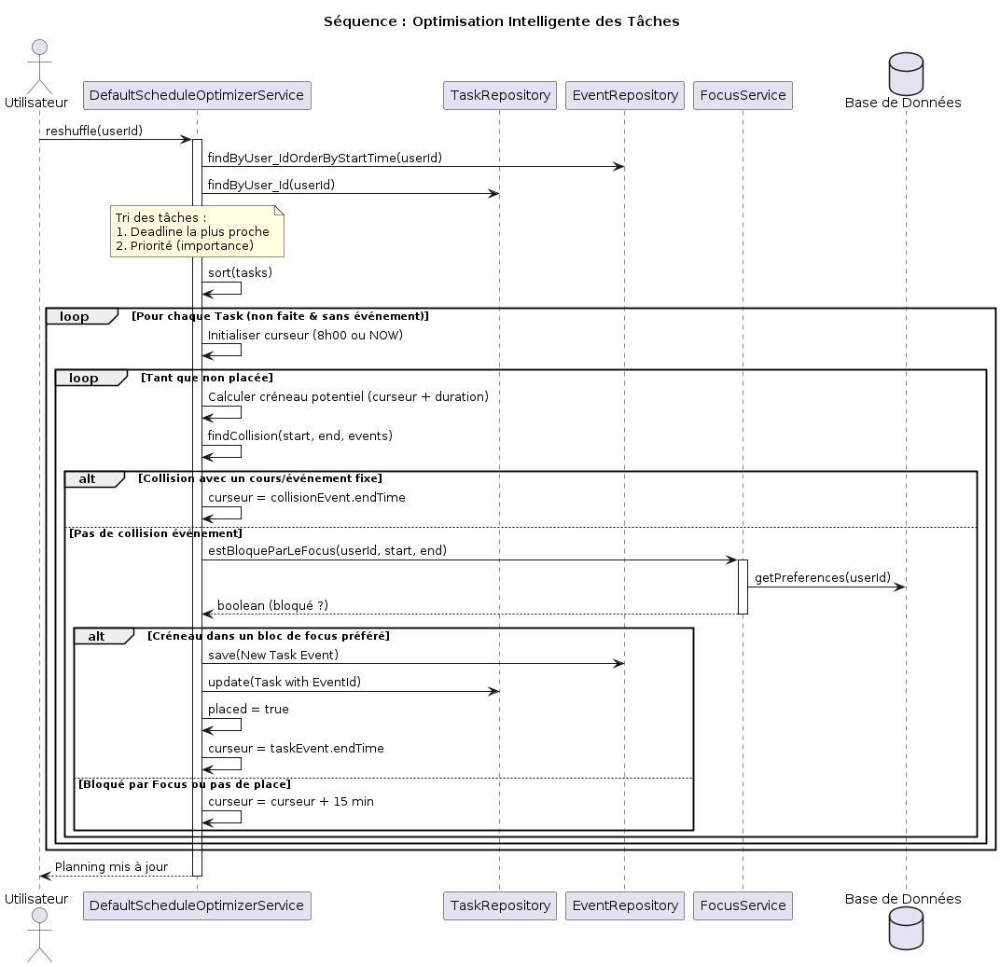
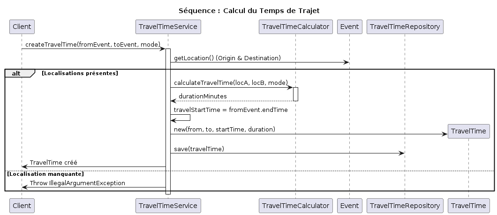
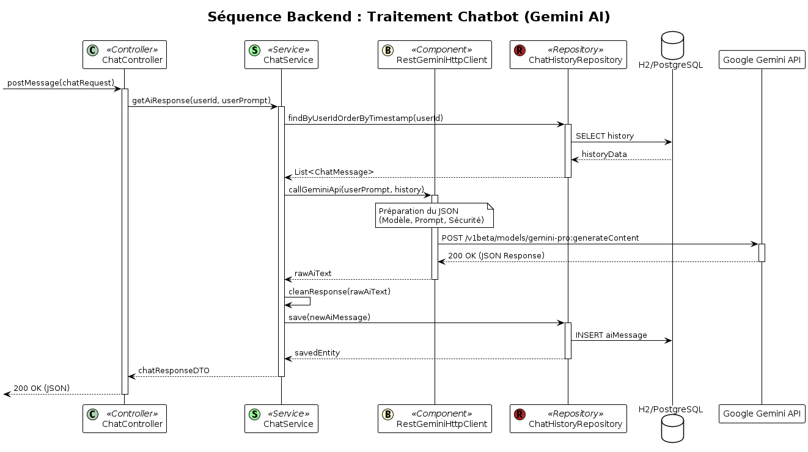
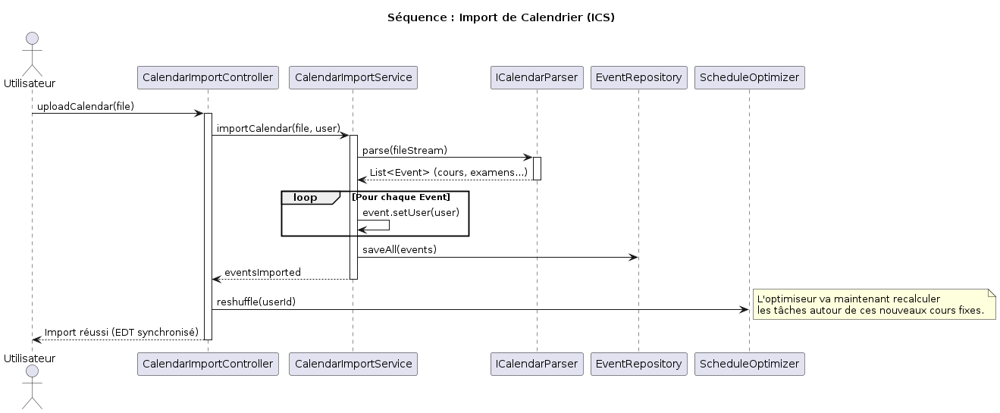
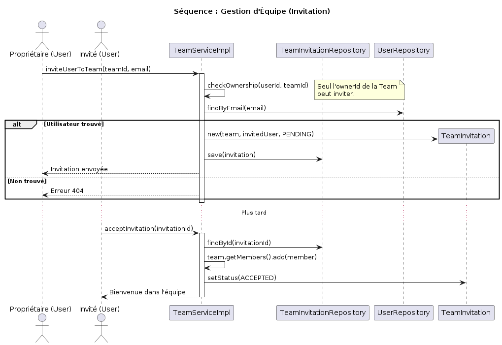
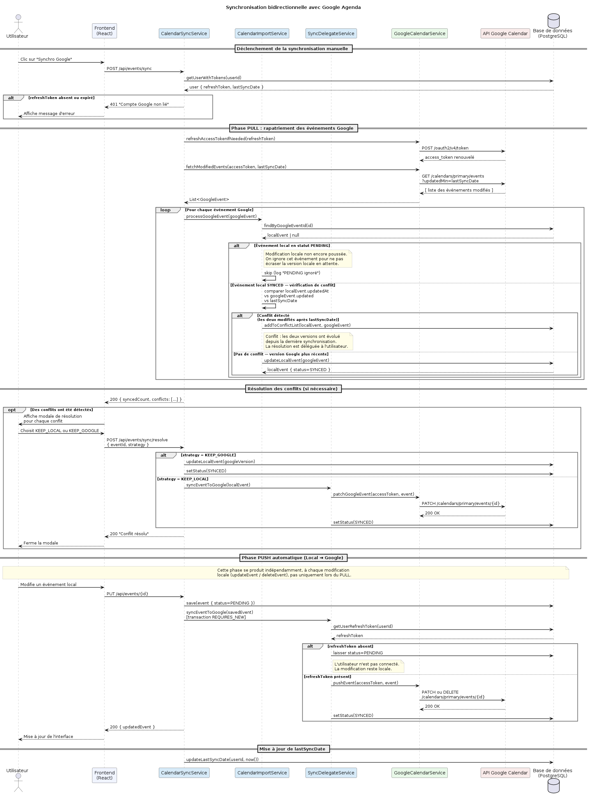

# Dossier Technique & Manuel Utilisateur
## Projet DevOps - DevOps1_EDT_Intelligent

**Équipe EDT Intelligent**  
**Université Paris Nanterre**

---

## Table des matières

1. [Introduction](#introduction)
2. [Architecture Technique](#architecture-technique)
3. [Manuel Utilisateur](#manuel-utilisateur)
4. [Fonctionnalités Détaillées & Implémentation](#fonctionnalités-détaillées--implémentation)
5. [Tests et Qualité Logicielle](#tests-et-qualité-logicielle)
6. [Conclusion](#conclusion)

---

## Introduction

Ce document présente l'application **DevOps1_EDT_Intelligent**, un système de gestion d'emploi du temps intelligent. Il détaille l'architecture technique, les processus DevOps mis en place et le guide d'utilisation, en s'appuyant sur les standards de qualité logicielle. L'objectif principal est de fournir une plateforme centralisée permettant de gérer ses tâches, son emploi du temps, et d'optimiser ses périodes de travail grâce à l'intelligence artificielle et l'analyse de données.

---

## Architecture Technique

### Diagramme de Classes UML

Le diagramme suivant représente la structure globale du backend de l'application. Il est généré automatiquement à chaque modification du code Java.



### Technologies Utilisées

- **Backend :** Java 21 avec Spring Boot 3
- **Frontend :** React / Vite avec Tailwind CSS
- **Base de données :** PostgreSQL (H2 pour les tests)
- **Build :** Gradle
- **CI/CD :** GitHub Actions
- **IA :** Google Gemini API

### Intégration Continue (CI)

Plusieurs workflows GitHub Actions assurent la stabilité du projet :

- **Build & Test :** Compilation et exécution des tests unitaires à chaque push
- **Analyse de Qualité :** Utilisation de SonarCloud pour détecter les vulnérabilités et la dette technique
- **Couverture de Code :** Génération de rapports Jacoco avec un seuil minimal de 60%
- **Génération Doc :** Mise à jour automatique des diagrammes UML et de la documentation PDF

### Génération UML Automatique

À chaque modification dans `backend/src/main/java`, un workflow spécifique s'exécute :

1. Une tâche Gradle (`generatePlantUml`) exécute un utilitaire Java qui scanne les classes et génère le fichier `diagram_classes.puml`
2. PlantUML convertit tous les fichiers `.puml` du dossier `doc/uml/` en images `.png`
3. Les changements sont automatiquement "commit" et "push" sur la branche de documentation

---

## Manuel Utilisateur

### Prérequis et Configuration

Avant de procéder à l'installation, assurez-vous que les éléments suivants sont configurés sur votre machine :

- **Java Development Kit (JDK) 21 :** Indispensable pour compiler et exécuter le backend
- **Node.js (version 18+) et npm :** Requis pour le frontend
- **Variables d'environnement :** Créez un fichier `.env` dans `backend/` avec les clés `DB_URL`, `DB_USER`, `DB_PASSWORD` et `GOOGLE_API_KEY`

### Installation et Lancement

1. **Clonage :** 
   ```bash
   git clone https://github.com/uciie/DevOps1_EDT_Intelligent.git
   ```

2. **Backend :**
   ```bash
   cd backend
   ./gradlew bootRun
   ```

3. **Frontend :**
   ```bash
   cd frontend
   npm install
   npm run dev
   ```

---

## Fonctionnalités Détaillées & Implémentation

### Gestion des Tâches

Le système permet une gestion granulaire des tâches individuelles ou d'équipe.

#### Implémentation

Les extraits de code source sont disponibles dans le dépôt GitHub. La classe `TaskServiceImpl` implémente la logique métier pour la création, modification et suppression des tâches.

#### Diagramme de séquence



### Optimisation de l'Emploi du Temps

Cette fonctionnalité planifie des sessions de travail en fonction des trous dans l'agenda.

#### Algorithme de sélection

La stratégie de sélection par défaut priorise les tâches selon leur deadline et leur importance. Le code source est disponible dans `DefaultTaskSelectionStrategy.java`.

#### Diagramme de séquence



### Calcul des Temps de Trajet

Le système calcule automatiquement le temps nécessaire pour se rendre d'un événement à un autre.

#### Implémentation

Le calculateur de trajet simple estime le temps de déplacement entre deux localisations. Pour plus de détails, consultez `SimpleTravelTimeCalculator.java`.

#### Diagramme de séquence



### Chatbot Assistant (Gemini AI)

Un assistant virtuel répond aux questions sur le planning via le langage naturel.

#### Fonctionnement

L'assistant utilise l'API Google Gemini et reçoit le contexte de l'utilisateur (événements et tâches).

#### Diagramme de séquence



### Mode Focus et Productivité

Le mode Focus aide à identifier les meilleures périodes de concentration.

#### Implémentation FocusService

Le service Focus analyse les préférences utilisateur et suggère des créneaux optimaux. Consultez `FocusService.java` pour l'implémentation complète.

### Import d'Agenda (ICS)

L'utilisateur peut importer ses calendriers ADE ou Google Calendar via des fichiers .ics.

#### Implémentation Service

Le service d'import parse les fichiers ICS et synchronise les événements. La logique est implémentée dans `CalendarImportService.java`.

#### Diagramme de séquence



### Gestion d'Équipe et Collaboration

Permet de partager des tâches et d'inviter des membres dans une équipe.

#### Diagramme de séquence



---

### Synchronisation avec Google Agenda

La synchronisation bidirectionnelle avec Google Agenda repose sur le protocole OAuth 2.0 et l'API Google Calendar v3. Elle s'articule autour de trois services Spring Boot : `UserService`, `CalendarSyncService` et `SyncDelegateService`.

#### Authentification OAuth 2.0

Lors du premier accès, le frontend redirige l'utilisateur vers la page de consentement Google avec les scopes `calendar.readonly` et `calendar.events`. Au retour, le composant `GoogleCallback.jsx` transmet le code d'autorisation au backend via `POST /api/users/{id}/google-auth`. `UserService.saveGoogleTokens()` échange ce code contre un `access_token` et un `refresh_token`, tous deux persistés en base. Le `refresh_token` n'étant fourni par Google qu'à la première autorisation, il est conservé indéfiniment pour permettre le renouvellement silencieux de l'`access_token`. La déconnexion est assurée par `DELETE /api/users/{id}/google-auth`, qui efface les deux tokens en base.

#### Push automatique (Local → Google)

Chaque modification ou suppression d'événement dans l'application déclenche, en fin de traitement, un appel à `SyncDelegateService.syncEventToGoogle()`. Ce service vérifie d'abord la présence d'un `refresh_token` valide pour l'utilisateur. Si le token est absent, l'opération est ignorée silencieusement et l'événement conserve son statut `PENDING` en base. Si le token est présent, `GoogleCalendarService` renouvelle l'`access_token` si nécessaire, puis appelle l'API Google Calendar (`PATCH` pour une mise à jour, `DELETE` pour une suppression). L'appel est exécuté dans une transaction indépendante (`@Transactional(propagation = REQUIRES_NEW)`) afin qu'un échec réseau ne compromette pas la persistance locale. Le statut de l'événement est mis à jour en `SYNCED` en cas de succès.

#### Pull manuel (Google → Local)

Le bouton **"Synchro Google"** déclenche `CalendarSyncService.syncFromGoogle()` via `POST /api/events/sync`. Le service récupère depuis l'API Google Calendar tous les événements modifiés après le champ `lastSyncDate` de l'utilisateur. Pour chaque événement distant, la méthode `CalendarImportService.pullEventsFromGoogle()` vérifie si un événement local correspondant existe (par `googleEventId`). Les événements dont le statut local est `PENDING` sont ignorés afin de préserver les modifications locales non encore poussées. Pour les autres, la date de dernière modification (`updatedAt`) est comparée à celle retournée par Google pour détecter un conflit éventuel. `lastSyncDate` est mis à jour en fin de traitement.

#### Détection et résolution des conflits

Un conflit est déclaré lorsqu'un événement local présente un `updatedAt` postérieur à la `lastSyncDate` **et** que la version Google a également été modifiée depuis cette même date. `CalendarSyncService.detectConflicts()` constitue la liste des conflits et la retourne au frontend. L'interface affiche une modale de résolution permettant à l'utilisateur de choisir la version à conserver (`KEEP_LOCAL` ou `KEEP_GOOGLE`) ou de fusionner les champs manuellement. Le choix est transmis via `POST /api/events/sync/resolve`, qui applique la stratégie sélectionnée et met à jour le statut de l'événement en `SYNCED`.

#### Diagramme de séquence



---

## Tests et Qualité Logicielle

Le projet suit une approche de développement piloté par les tests (TDD).

### Tests Unitaires et Mockito

Tous les services critiques disposent de tests unitaires utilisant JUnit 5 et Mockito. Les tests sont disponibles dans le package `src/test/java`.

### Couverture de Code

Le rapport Jacoco est généré à chaque build. Nous visons une couverture d'au moins 60% sur les services critiques.

---

## Conclusion

L'application **DevOps1_EDT_Intelligent** répond au besoin croissant d'organisation personnelle et collective. L'automatisation des processus DevOps assure une haute qualité logicielle.